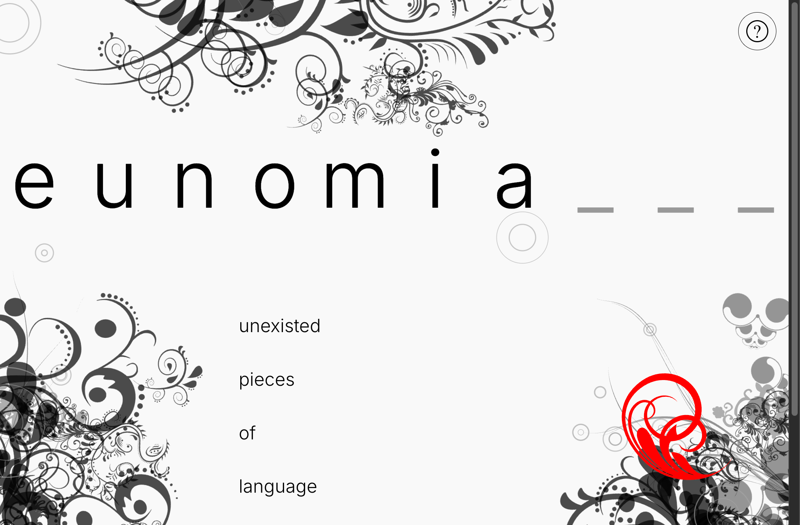

# ׅ⋆༊. ݁eunomia⊹⋆₊

[](https://yyuyulm.github.io/word_diffusion/)

An experimental discrete masked diffusion transformer model that generates English words, natively running entirely natively inside your browser leveraging WebGL and WebAssembly via ONNX Runtime Web.

🌟 **[Live Demo: eunomia](https://yyuyulm.github.io/word_diffusion/)**

## Introduction

This project is an exploration into applying bidirectional attention diffusion transformers—similar to modern image generation architectures—to discrete sequence text generation, constructing spelling from scratch without traditional causal autoregressive left-to-right constraints. 

For the deep dives on the theory, methodology, and the beautiful machine learning and front-end magic:

- [Part 1: How does the model work and how can you train one yourself?](./write-ups/on-model-training.md)
- [Part 2: Website design and creative vibe coding](./write-ups/on-website-design.md)

## Repository Structure

```text
word_diffusion/
├── pytorch_md4/    # Core ML logic. Contains PyTorch model definition, training loops, dataset loading, and ONNX export.
├── website/        # SvelteKit frontend web-app. Connects to the exported ONNX model via ORT-Web for in-browser inference.
├── write-ups/      # Documentation detailing the philosophy and engineering behind the project.
└── data/           # Directory placeholder to store local raw dataset text files (git ignored).
```

## Local Development Setup

This repository contains two distinct application spaces. Ensure you are operating in the correct directory for your task!

### 1. Training & Exporting the Model (`/pytorch_md4`)

For the Python backbone, we highly recommend using [uv](https://github.com/astral-sh/uv) for your environment and dependency management as it is blazingly fast and deterministic.

```bash
cd pytorch_md4

# Create a clean virtual environment
uv venv

# Activate the environment (macOS/Linux)
source .venv/bin/activate
# (For Windows: .\.venv\Scripts\activate)

# Install the project and dependencies from the pyproject configuration
uv pip install -e .
```

### 2. Serving the Website locally (`/website`)

The frontend is built on [SvelteKit](https://kit.svelte.dev/) and executes the neural network dynamically client-side. Make sure you have Node/npm installed.

```bash
cd website

# Install standard node dependencies
npm install

# Start the local development server with hot-module reloading enabled
npm run dev

# You can access the local site at http://localhost:5173
```
