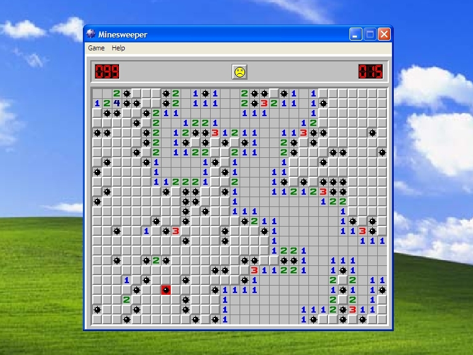

# Training a Large Language Model that Runs in Your Browser

*--Yes! A Large Language Model (LLM) that runs LOCALLY in your browser, because words are language and one million is still a large number.*

This blog is part of the a technical breakdown of my recent project [Eunomia](https://yyuyulm.github.io/word_diffusion/), a website where you can generate new words that appears lexically English-looking, powered by a diffusion transformer model (you will know what it means after reading this blog!) that runs in the visitor's browser. This post is going to cover the model architecture, and design consideration, training, and inference (especially conditioning), as well as some reflections on training local-first tiny models.

### transformer

trans·​form·​er /tran(t)sˈfôrmər/

noun

1.  ~~an apparatus for reducing or increasing the voltage of an alternating current.~~

2.  ~~a person or thing that transforms something.~~

3.  a machine learning architecture pioneered in 2017 paper [*Attention Is All You Need*](https://arxiv.org/abs/1706.03762), widely adopted as the default architecture for current generative AI system such as ChatGPT\*, Claude\*, Google Gemini\*, Stable Diffusion\*\*, Midjourny\*, Suno\*, etc.

*\*speculation, with high confidence*

\*\**specifically* *Stable Diffusion 3 and above at time of writing*

\
If you don't know what transformer is, this blog is probably going to be a bit confusing at parts for you but I am writing with technical and non-technical audiences in mind. I self taught everything I know about AI/ML as an artist and it was quite fun and inspiring and not that difficult :)\

## 1. "Let there be word generator." and there was the history of language (and image) modeling.

*How do you approach a task such as generating something that looks like English words but is not?*

One obvious (if you know how modern LLMs work) answer these day is auto-regressive transformer, but I would say the task of word generation is much simpler and different than what LLMs are tasked for, so I want to walk you through my thought process and a brief history of language modeling to justify my final choice of discrete masked diffusion transformer (you will know what this means by the end of the blog).

So, back to the question, how to generate something that looks like English words but is not? I suppose the answer involves learning from existing English words, and maybe somehow you find a bunch of rules such as "q" is always followed by "u", "sh" and "ch" are common fragments and are mostly followed by vowels, then the computer can assemble words based on those rules. This is similar to what people tried in the 1960s-70s, using hard-coded rule-based systems that mimics human language such as the famous [ELIZA system](https://en.wikipedia.org/wiki/ELIZA). ELIZA operates on certain key words as triggers for certain phrases/sentences/expressions to continue a dialogue, such as seeing "same" means responding "In what way?". Sounds mechanical, but if such rules are well written and exhaustive, one can imagine it performing well, but the problem is how to come up with a ideal rule system, let alone one that can be translated into a computer program?

Welp, maybe the computers can help us with that also? People then moved on to training models to learn the rules from large datasets based on statistic principles rather than hand coding human knowledge, i.e. modeling (making a generator/solver for something/some problem) through machine learning. In five year old's words, we ask the model to looks at texts and she be like "I see there is a lot of cases where 'I' is followed by 'am', so when I see 'I' I should guess the next word to be 'am' so I can be right more often than guessing randomly." Back then a common model is N-gram model, which essentially works by learning probability of going from one specific word to all other words as next word (to be exact, the past N (a number) words to next word, hence the name N-gram). The same principle is still used today in ChatGPT, in fact, it is just the model got much more capable (being able to look at all the past words!) and much bigger as well.

{width="423"}

*(Sometimes I wonder if people today would fail the [Turning](https://en.wikipedia.org/wiki/Turing_test)[test](https://courses.cs.umbc.edu/471/papers/turing.pdf) if they are teleported back in time.)*

However, most of these architectures have something that I don't sit quite well with, which is the fact that assume word as something constructed from left to right, i.e. there is no effect (or causal relationship) that the later letter can have on the ones that came before. I wonder if this might have to do with my first language being Chinese, whose character (each are words, more or less) are more of a whole symbol which has no directional causal logic in how they are constructed and is more like an image, where each part are all correlated to other parts mutually. Taking that idea a step further, if we think of words like an one-dimensional image, then we can borrow the technique used in modern image generation models, i.e bi-directional attention diffusion transformer model (part 2 is all about this), but also other candidates such as VAE or GAN.

*VAE: Variational Auto-Encoder. Compressor + de-compressor. It learns to turn words into short-hands/hints (called latent) and turn that back into the original words as much as possible. Then we can give the de-compressor random short hands then it would turn that to believable guesses that are fake word. Simialr to how you can guess abbreviation, like iykyk, and if you give people random letter sequences tell them its an abbreviation and all their guesses to expand it would be meaningful phrases rather than gibberish.*

*GAN: Generative Adverserial Networks. Generator + critic. This is actually two models. For our example, one learning to tell fake words, the other learning differentiate the real words from fake ones generated by the first model. Over time as they compete the first model would get better than generating believable words.*

Again, word modeling is probably a relatively simple task, which means models that are too powerful (low bias, to be more accurate), e.g. transformers, could have the risk of over-fitting (when models try too hard they just memorize things rather than learning anything useful). To be honest, I never tested the performance of other architecture such as VAE or GAN, but I eliminated them from my plan for the following reasons:

1.  There is less literature on discrete sequence VAE and GAN, as well as code-base with up-to-date dependencies.
2.  Conditioning (length, starting letters, etc) and in-painting (filling in letters given fixed letters at certain positions) would be much less straight forward to implement than diffusion transformer (or I should say there is a clever way to train a model for which conditioning IS in-painting! More on that in part 2), since I don't really want to get involved with CFG and the complexity and hyper-parameters it brings, as a newbie to training my own models.
3.  [Diffusion Beats Autoregressive in Data-Constrained Settings](https://arxiv.org/abs/2507.15857). Key take away being diffusion seems to allow and benefit from multi-epoch training (training on the same data over and over) without over-fitting, and what I hear is more forgiving on training and tuning than auto-regressive transformer but probably also VAE and GAN as well.
4.  I am just simple more interested in learning about diffusion transformers for discrete data. The heart does what it wants.

## 2. Masked diffusion? More like Minesweeper: the unmasking process and conditioning

{width="485"}

*(screenshot of Microsoft Minesweeper on Windows XP)*

### 2.1 What is a masked diffusion transformer and how does it works?

Apologize for putting the core concept off till now, but lets get into it.

(If you already know what masked diffusion is, see you in 2.2, or take a peek and maybe you will enjoy the Minesweeper analogy :)

Transformer is an deep learning architecture (which means its like many blocks of numbers), but what make it really different than others is this mechanism in it called "attention". This fancy word basically means the model can look at each part of their input and their relationship with everything single other part of the inputs. If you have played the game [Minesweeper](https://minesweeper.online/) (if not you are missing out a bit), then the machine learning model essentially sees something like the Minesweeper grid, and it would pull information together from the state of each grid and how their interact with each other and infer on the meaning of them, like how you infer where the mine is based on how the number are arranged. So to put it simply, "attention" is just a way for the model connect the dots among different parts of its inputs.

In auto-regressive style transformers (ChatGPT etc.), people constrain the attention to be only causal, which means only all parts of the input can only interact with other parts that came before it, or putting it in negative, the later parts cannot have any effect on the proceeding parts, like how tomorrow don't affect today and today don't affect yesterday (if you are not a quantum physicist that is). However, you can see this might have issue with inputs like images (pixel grids), and MineSweeper grids, where there is no intrinsic order in the input parts: one pixel is somewhat related to every other pixels and you don't see an image by look at it left to right top to bottom. You look at all the pixels all at once and lower right corner might suggest something about the upper left corner and vice versa, like I mentioned in part 1. So how do you start generating something part by part when its all correlated? Welp, what's your first move at a fresh game of Minesweeper?

Click on a random square, yep, and you hope that's not a mine as hard as you can. This is the where the "diffusion" part comes in. Diffusion is a modeling technique that essentially works like you playing MineSweeper: you start with a initial guess (usually from random guess), and you gradually refine based on what information you have now and take best guesses again and again towards the solution. So rather than relying on some intrinsic causal direction in the data like auto-regression, you rely on the direction that is the thinking/solving process. There are many type of diffusion, but all of them requires a collection of starting points that you either have in hand or can generate easily and a target collection you want, and the model learns to perform the process going from starting points to target points. In the case of Minesweeper, starting from the collection of all unknown grids to the collection of all solved grids. However, in the case of generators for images or words, we know the target collection (the images/words we have on hand), but what would be the starting points?

In practice, people use random guesses, not because it is good and close to the target, but because we can generate them cheaply and infinitely. For image, i.e. a block (array) of pixel values, height x width x color (RGB), we can just use a random value (think TV noise, but to be exact it is a sample from a[Gaussian distribution](https://en.wikipedia.org/wiki/Normal_distribution) of pixel values, having to do with what do we really mean by "random", but I won'get into it.). For words, we *can* start from a random letter sequence, and swap letters at various positions to reach a good looking word, but there is another way of doing it, which is to manually introduce a special "letter" (what they called token) that means "average/unknown letter", and call it "mask". Just like how Minespweer start with unknown grid, but the game actually knows whats underneath and its for the player to find out, this "mask" letter functions the same: it tells the model that it needs to replace it with its best guess. When there is no "mask" left, the generation is complete (GG in Minesweeper!). The benefit about doing it this way is three fold:

1.  There is always a way to tell if the process is finished.
2.  Whatever guess the model has taken stays that way in the final result
3.  This makes the math a lot easier than the replacement from random letters route (though I don't care since I am just copying it from papers).

However, the point of each guess stays unchanged till the end is important for my use case, since it allows the user to have more control of the generator, and let's get into how that works.

### 2.2 Being lazing paid off: conditioning and in-painting

So one of the key objectives I want this word generator to have is the ability for the user to control how long the words are and have the ability to pin down particular letters at specific positions. For example, generating only words that begins with letter "x", or generating only words that has follows the pattern "\_bl\_ \_" "\_sh_l\_" etc.

Conventially, these tasks are being treated as conditioning (for word length), or in-painting (pinning down certain letters), which requires additional training setup, data preparation, and hyper-parameter tuning (think adding additional ingredients and prep steps and finessing the ingredient ratio of a baking recipe), which I don't really want to get into nor feel confident in doing in my first model with custom architectures and objectives. Being lazy in action forces you to be more creative/hardworking in your thinking, and it worked here at least.

One way we can control the word length without explicit conditioning the model is to control the input length, i.e. giving the model 7 mask letters will result in a 7 letter word. However, one of the another key hassle regarding generating something like words is that the size/length of the training data varies, but GPU doesn't quite like that, which means we have to format all the input to be the same length through padding "letter" (filling up the packaging box with brown paper shreds). These padding (shreds) are usually zero-ed out in their attention result which means we tell the model to ignore them since they are just fillers:

We give model `<mask><mask><mask><mask><pad><pad>` (lets say the max length here is 6 letters)

It sees `<mask><mask><mask><mask>`

Then it generates: `<w><o><r><d>`

This means we have to decide the length to generate before the generation, but being lazy as I am, I wonder if the model can learn that as well. This inspired me to use padding as a way to inject conditioning information such as word length, but allowing the model to generate and see padding rather than ignoring them.

We give model `<mask><mask><mask><mask><mask><mask>`

It sees `<mask><mask><mask><mask><mask><mask>`

Then it generates: `<w><o><r><d><pad><pad>` , or `<w><o><r><l><d><pad>`

This allows the model to naturally learn the length distribution by learning to place padding itself that best mimics the length distribution of natural words. Since in masked diffusion what ever is unmasked stays unmasked and stay unchanged, we can control word length by revealing padding in the initial input:

We give model `<mask><mask><mask><pad><pad><pad>`

It sees `<mask><mask><mask><pad><pad><pad>`

Then it generates: `<w><e><t><pad><pad><pad>`

Yay! We have length control, or really?

Upon seeing `<mask><mask><mask><pad><pad><pad>`

The model can also generate `<a><t><pad><pad><pad><pad>` , or even `<a><pad><pad><pad><pad><pad>` since we now include padding in the possible outputs.

So here we introduce another special letter(token), `<eow>` (end of word), which follows the last letter of the word (like the number grid in Minesweeper, which means there is mine next to me!). This means when the model sees it, it knows the letter(token) before it has to be an actual letter not `<pad>` . For example:

We give model `<mask><mask><mask><eow><pad><pad>`

It sees `<mask><mask><mask><eow><pad><pad>`

Then it generates: `<w><e><t><eow><pad><pad>`

`<a><t><pad><eow><pad><pad>` , or `<a><pad><pad><eow><pad><pad>` would not be generated since the model never sees `<pad>` before `<eow>` in its training data.

This also allows user to not only specify the exact length of words that they want (5, 7, 8), but specify a max word length (under 5, under 10, etc.) by not providing `<eow>` but only `<pad>` and `<mask>` that take up the max word length + 1 (for end of word token).

Initial letter or specific letter at specific position works similarly. If we just put those letters at the position we want in the initial input to the model, since the model cannot change whatever is not `<mask>` but still uses that information to infer the letters around them, we can generate words following defined patterns:

We give model `<h><mask><mask><e><eow><pad>`

It sees `<h><mask><mask><e><eow><pad>` , and thinks "oh it seems to be a 4 letter word that begins with 'h' and end with 'e', let me recall what those words look like..."

Then it generates: `<h><o>
<e><eow><pad>` , or `<h><o><m><e><eow><pad>`

Voilà! We successfully enabled functionality without complex setup by formulating the problem in a more general way.

*Okay, if you are an expert in diffusion model, you might be like, "wait a minute, injecting things into the initial input like this would make the input miss match the time condition." and you are correct, but in practice I simple do a inverse lookup of the ratio of mask present on the noise schedule and use that as the starting time and decrease the steps count proportionally. It works in practice.*

*(Also, the next part is pure nerding-out and optional for non-technical crowd, see you in part 4)*

## 3. DJ'ing academic code bases with AI: Model architecture

*TLDR: The model uses a [MD4 loss](https://arxiv.org/abs/2406.04329) on [Qwen3 style transformer blocks without attention gating](https://arxiv.org/abs/2505.06708), trained with [Muon optimizer](https://kellerjordan.github.io/posts/muon/), conditioned with a [JiT style multi-token in-context conditioning](https://arxiv.org/abs/2511.13720v1).*

Knowing that I would probably end up in data limited regime (there is just not that name English words to begin with), I started from the [Diffusion Beats Autoregressive in Data-Constrained Settings](https://arxiv.org/abs/2507.15857) and tracing back from their implementations and references, which lead me to [Simplified and Generalized Masked Diffusion for Discrete Data](https://arxiv.org/abs/2406.04329). This is one of the four referenced work on discrete masked diffusion, most recent (2025 Arixv), seems simple in implementation (I trusted the title, because I can't follow the mathematical proof in the paper), and most importantly has experiments on text modality and even including character level tasks. A bonus point, its a Google DeepMind paper which means I get to reference their [JAX implementation](https://github.com/google-deepmind/md4) but also learn by re-implementing it from scratch in PyTorch (they have a [Pytorch repo](https://github.com/darioShar/pytorch-md4) but it is hmm...not as substantial lets say...).

Suprisingly (or if you are smarter than me than it might not be a surprise to you), the only difference between diffusion transformer and auto-regressive transformer is their loss, and all the other architecture decisions (position encoding, attention modifications, activation functions in MLPs etc.) are orthogonal to that and can be directly used for either objectives. This means I can borrow code from any auto-regressive LLM implementation, so I, a superficial artist, choose to use (one of) the NeurIPS 2025 best paper, [Gated Attention for Large Language Models: Non-linearity, Sparsity, and Attention-Sink-Free](https://openreview.net/forum?id=1b7whO4SfY), i.e. Qwen 3's transformer block implementation. However, a lot of the modification (over the original [2017 implementation](https://arxiv.org/abs/1706.03762)) in that implementation are specific tailored for large LLMs, so I ended up adopting only the following modifications: pre-norm, RMS norm (still layer norm in when using [adaptive layer norm](https://arxiv.org/abs/1911.07013) or AdaLNZero for conditioning), SwiGLU. Due to the small length of the target sequence (32 tokens, 31 letter for max word length) I choose to use absolute position embedding over RoPE, skipping gated attention due to smaller model size and data size, both of which are proven to be more effective through ablation experiments.

To speed up training (GPU poor here, M1 Macbook kind of poor), I also experimented with the new cool kid in town, Muon optimizer, popularized in LLM by [Kimi AI and their recent models](https://arxiv.org/abs/2502.16982). I just have to say it worked like a charm. A decent implementation is included by default in PyTorch 2.9+ with auto learning rate translation from AdamW (Feeling blessed by open-source). No much to say here, `torch.optim.Muon` and the loss go brrrrrrr (instead of brrr).

The last tweak I added is I think the most interesting. Diffusion model requires conditioning on the de-noising time step, i.e. we need a way to let the model know how noisy the data currently is (though [some recent paper](https://arxiv.org/abs/2602.18428) suggests it might be optional). Most diffusion transformers, whether for image or text or other modality, continuous or discrete, have been using adaptive layer norm's scale and bias as way to do that conditioning, as well as other conditioning such as class (think type, labels etc), or textual description or reference image etc. This has been changing due the demand for more accurate text-to-image and image edit model, which mostly uses a multi-modal diffusion transformer (MMDiT) that conditions using in-context conditioning across modalities, but time conditioning still are mostly done through modulation (e.g. adaptive layer norm), in models like [Stable Diffusion 3](https://stability.ai/news-updates/stable-diffusion-3-research-paper).

However, a recent (at the time of training my model) paper [Back to Basics: Let Denoising Generative Models Denoise](https://arxiv.org/abs/2511.13720), have a little size quest, which is experimenting with injecting time conditioning in-context, i.e. using time token in attention layer rather than modulate attention and MLP output. [Prior studies](https://arxiv.org/abs/2312.04557v1) compared conditioning with cross attention, adaLN, or in-context, and concluded that adaLN-zero is the obvious winner, and hence it has been adopted as the default. The incredible and kind of hilarious idea the JiT team had is: all of the results so far is one in-context condition token performs worse than AdaLN, but what if there is multiple copies so the model is forced to "attend" to it more? So they duplicated the condition token multiple times in the context, and it worked. It worked just as well if not better than modulation for class conditioning (I swear there is an early version of the paper where they applied the same idea to time conditioning as well, which removed adaLN layers all together, but I cannot find that version). I adopted the same idea for time conditioning for my model with 4 copies of the time conditioning token (experimentally proven to perform better than 1 or 2 copies, and on par with AdaLN/AdaLN-zero through ablation). Despite it does not increasing modeling performance, it significantly shrunk the model size, since the AdaLN shift and bias MLP can take up a significant portion of parameter count (around 33% in my case) and offers minor speed up during inference (shorter compute graph). Since we are deploying the model across web, less parameter means smaller model to download and faster inference is always a plus, so there is no reason not to use it.

As for the training setup, the training is tested locally but ablation studies are done on L4 on Google Colab. The final full training run is done locally on a M1 Macbook Pro over 30 min. The final model size is 0.8M parameters (827K to be exact), with 64 hidden dimensions, 12 layers of transformer blocks, and 4 attention heads, using in-context time conditioning with 4 copies of conditioning token, the generalized MD4 loss, batch size of 64 over 10 epoch using Muon optimizer, and the checkpoint is taken from EMA with rate 0,997. Various ablation studies has been done (8 layers, 128 dim, 8 heads, time conditioning methods, attention gating, noise schedule, loss type, batch size and learning rate, etc), but I am leaving the results and chart to an update of this post :)

## 4. Data source: good data \> more data

*Even though I put this part last, this is actually what I figured out first. If you are considering training your own model, always always find datasets first. Nothing hurts more than having a brilliant idea but realizing there is no proper dataset for it.*

As for data, I thought I can just find a dictionary and use the word list, but unfortunately the last open version is the 1919 Oxford English Dictionary and it is a only a scan, and requires digitization and structured extraction (.csv please). There is the [The Online Plain Text English Dictionary](https://www.mso.anu.edu.au/~ralph/OPTED/) which is based on the 1913 US Webster's Unabridged Dictionary. It would be interesting to train a version of the model of this dataset and compare the output, and maybe another model from early/middle English dataset from Bibles and other text records (reach out if you wanna see them or collaborate on a model on other datasets?).

I digress. I found this Github repository [dwyl/english-words](https://github.com/dwyl/english-words) which was for auto complete related projects (I guess this project is auto-complete is someway?), and this dataset was used as the base for initial testing an training code development.

Later the data set was expanded with [Wiktionary](https://en.wiktionary.org/wiki/Wiktionary:Main_Page), and [OpenWordNet](https://en-word.net/), which are both open source dictionary-ish projects. The datasets are cleaned through the following steps:

1.  Separating multiple word/phrases, removing hyphenated words, abbreviations, proper nouns and names (any words with capital letters)

2.  Combined and de-duplicated

3.  Removing words that are just other words with an "s" added at the end as plural/conjugation forms. This is because the target use case is for brand name, project name generation and such data would heavily bias the model to end words with "s". For intended use cases, user can add those form changes themselves.

I trained a version of the model with the combined dataset, and realized it subjectively perform worse than only using dwyl/english-words, due to Wikitionary containing a lot of Chemical substance and other terminologies, which is not fitting for the intended use case. In the end I just used dwyl/english-words cleaned through the steps above for the final model deployed on the website. The final model supports generating words up to 31 letters in length, which is also the length of longest word in the dataset. Though, the website as of now limit the generation length to up to 10 letter words for aesthetics and design.

## 5. Conclusions and reflections

I think most of us at certain point might have felt a bit lost and powerless in the face of rapid AI progress. Training my own model might be a subconscious way of getting through that. These technologies are not as foreign nor magical as they appear to be. Not saying that the progress is fake, but rather the LLM capabilities should be somewhat expected, as a result of enough compute, enough data, and enough understanding of the model learning dynamics. As [Ilya Sutskever](https://en.wikipedia.org/wiki/Ilya_Sutskever) had said, "the model just want to learn", and what the researcher are doing is less like giving model more capabilities to learn, but more like removing the obstacle that hinders the model's learning. I think I felt that a little bit through the process of this project, how it is not that there are some magic that I am doing to turn the data into a model, but rather the model has always been there in the data, and what I have done is merely finding the correct radio antenna that allows me to receive its output. It is a strange feeling, and I am describing it the best that I can, but I would really recommend anyone who has the interest to go through the process themselves. At this particular point in history, I think this kind of statistical view point can allow us to interpret current events and more to come with a different lens: something has been written into history a while ago in the past, and it perhaps we are only starting to hearing it's speech. Not saying that we do not have agency in how we want to listen and react. We definitely do, like how I can formulate the modeling problem differently to achieve my goals, but we also have to recognize the existing accumulation of data that we are dealing with. History has its own voice that we must listen and respond to properly.

Back to something more grounded, I really enjoyed working with transformer architecture. I can see why it has dominated the field now, since it is essentially a really good clean slate, in my opinion. It is adaptive to any data modality, any loss/objective formulation, has various ways of conditioning. It assumes very little, while being very flexible for researcher to formulate and inject their assumptions if they consider it necessary. Also, it is really efficient for storing knowledge, since every input token shares the same parameter which decouples model size from input size. Especially when combined with Muon, since most of transformer's weights are 2D matrices, the training is quite efficient as well. It is a good medium for artists to make small models that can be easily distributed but packs a lot of functionalities.

I think that is it for this blog. In the next one I will dive into the website design for this project and creative coding that powers the animation and UI :)

P.S. This blog is written without the help of AI, thought the research and development of the project was heavily assisted by AI agents (coding and deep research).

P.P.S I just realized the blog does not mention the word AI once in the meat of the blog. Do I get a bonus point? Joke aside, does this tiny word generating model count as artificial intelligence? Genuining asking.